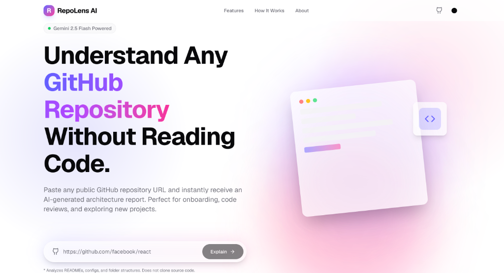

# RepoLens AI



AI-powered GitHub repository intelligence platform that helps developers understand unfamiliar repositories through automated architecture analysis.

## Overview

RepoLens AI addresses the challenge of onboarding and comprehending complex software repositories. Modern software projects often contain intricate architectures, undocumented design decisions, and deep dependency trees that require significant time investment to understand manually.

This project exists to automate the initial discovery phase of repository analysis. By leveraging the GitHub REST API and Google's Gemini Large Language Model, RepoLens AI synthesizes raw codebase metadata into a structured, highly readable dashboard.

It is designed for software engineers, technical recruiters, open-source contributors, and engineering managers who need to quickly evaluate the architecture, health, and complexity of a codebase without manually traversing the directory tree.

The platform works by extracting a concise, optimized snapshot of the repository (including file structures, core configuration files, and documentation) and supplying this context to the AI model. The AI then evaluates the repository against standardized metrics, generating a deterministic JSON payload that powers a responsive analytics dashboard.

## Features

- **Automated Architecture Diagrams**: Dynamically generates and renders Mermaid.js system architecture graphs based on the repository structure.
- **Repository Health Scoring**: Calculates an overall project health score (0-100) based on documentation quality, CI/CD presence, and structural organization.
- **Complexity Assessment**: Evaluates the codebase and categorizes it into complexity tiers (Beginner, Intermediate, Advanced, Enterprise) with contextual reasoning.
- **AI-Curated Learning Paths**: Generates a sequential, prioritized reading list of files to help developers understand the codebase efficiently.
- **Dependency Insights**: Identifies core project dependencies and explains their specific architectural role within the application.
- **Technical Interview Generation**: Synthesizes 5-10 technical interview questions based strictly on the detected architecture and stack.
- **Actionable Improvements**: Recommends structural or architectural upgrades specific to the repository's current state.
- **Export Functionality**: Supports exporting the generated analytics report to raw JSON, Markdown, or PDF formats.
- **Private Repository Support**: Capable of analyzing private repositories provided a valid GitHub Personal Access Token is configured in the environment.

## Screenshots

[Landing Page Placeholder]

[Repository Analysis Dashboard Placeholder]

[Generated Report Placeholder]

[Repository Health Dashboard Placeholder]

## Live Demo:
https://repolens-ai-coral.vercel.app/

## Technology Stack

### Frontend
- Next.js 15 (App Router)
- React 19
- Tailwind CSS
- Framer Motion
- Lucide React

### Backend
- Next.js API Routes (Serverless Functions)
- Node.js

### AI
- Google Gemini (`gemini-2.5-flash` model)
- `@google/genai` SDK

### External APIs
- GitHub REST API (`@octokit/rest`)

### Deployment
- Vercel

## Architecture

The application follows a standard Next.js monolithic architecture leveraging the App Router paradigm. 

### Frontend
The client application is built with React Server Components where applicable, shifting to Client Components for interactive dashboard elements (e.g., Framer Motion animations, Mermaid.js rendering, and export utilities). The UI is strictly governed by Tailwind CSS utility classes.

### Backend and API Routes
The backend consists of a single serverless API route (`/api/analyze`). This route handles request validation, external API orchestration, and error propagation. By keeping the AI orchestration on the server, API keys and access tokens are never exposed to the client.

### AI Service
The AI service utilizes the Gemini 2.5 Flash model. It is designed to strictly return validated JSON payloads. The service layer includes configurable timeouts, exponential backoff, and retry logic to ensure high availability.

### GitHub API Integration
The GitHub integration layer uses the official Octokit SDK to interface with the GitHub REST API. It performs sequential and parallel requests to gather metadata, file trees, and configuration files.

### Data Flow
1. Client submits a repository URL.
2. The `useAnalyze` hook triggers a POST request to `/api/analyze`.
3. The server validates and parses the URL.
4. The server requests repository metadata, language statistics, file trees, and specific configuration files from GitHub.
5. The extracted data is condensed into an optimized prompt payload.
6. The payload is sent to the Gemini API.
7. Gemini returns a structured JSON string.
8. The server parses the JSON and returns the formatted data to the client.
9. The client updates the application state and mounts the dashboard components.

## How It Works

1. User enters a GitHub repository URL
2. Application validates the URL and parses the owner and repository names
3. Repository metadata, file trees, and configs are fetched using GitHub REST API
4. Relevant repository information is extracted and truncated to fit context windows
5. Optimized context is sent to Gemini 2.5 Flash via a highly structured prompt
6. AI generates structured repository insights returning a deterministic JSON object
7. Results are parsed and displayed within the responsive client dashboard

## Installation

### Clone repository
```bash
git clone https://github.com/chiragdebugs/repolens-ai.git
cd repolens-ai
```

### Install dependencies
```bash
npm install
```

### Configure environment variables
Copy the example environment file and populate it with your credentials:
```bash
cp .env.example .env.local
```

### Run development server
```bash
npm run dev
```
Navigate to `http://localhost:3000` to view the application.

## Environment Variables

The application requires specific environment variables to function correctly.

| Variable | Description | Required |
|----------|-------------|----------|
| `GITHUB_TOKEN` | A GitHub Personal Access Token (PAT). Required to bypass strict API rate limits and to allow the application to analyze private repositories. Requires `repo` scope for private access. | Yes |
| `GEMINI_API_KEY` | An API key from Google AI Studio. Used to authenticate requests to the Gemini model for architecture analysis. | Yes |
| `GEMINI_MODEL` | Specifies the exact Gemini model to use. Defaults to `gemini-2.5-flash` if not provided. | No |

### Example `.env.local`
```env
GITHUB_TOKEN=ghp_your_github_personal_access_token_here
GEMINI_API_KEY=AIzaSyYour_gemini_api_key_here
GEMINI_MODEL=gemini-2.5-flash
```

## Project Structure

- `app/`
  - Contains the Next.js App Router structure, including pages, layouts, and global CSS. Also houses the serverless API routes under `app/api/`.
- `components/`
  - Contains all reusable React components. Divided into specialized UI elements such as `HealthScore.tsx`, `MermaidViewer.tsx`, and `DependencyGrid.tsx`.
- `lib/`
  - Contains core business logic, utility functions, external API integrations (`github.ts`, `gemini.ts`), prompt generation logic (`parser.ts`), and global TypeScript interfaces (`types.ts`).
- `hooks/`
  - Contains custom React hooks, specifically `useAnalyze.ts` for managing the asynchronous state of the analysis API call.
- `public/`
  - Contains static assets like images, icons, and fonts served directly by Next.js.

## API

### `POST /api/analyze`

**Purpose**: Orchestrates the fetching of GitHub data and generation of the AI architecture report.

**Request Body**:
```json
{
  "url": "https://github.com/facebook/react"
}
```

**Successful Response (200 OK)**:
```json
{
  "info": {
    "owner": "facebook",
    "repo": "react",
    "stars": 200000,
    ...
  },
  "report": {
    "healthScore": 95,
    "complexity": { ... },
    "mermaidDiagram": "...",
    ...
  }
}
```

**Error Responses**:
- `400 Bad Request`: Returned if the URL is missing, invalid, or belongs to a user profile rather than a repository.
- `404 Not Found`: Returned if the repository does not exist or if the provided `GITHUB_TOKEN` lacks permissions to view the private repository.
- `500 Internal Server Error`: Returned if the GitHub API rate limits are exceeded or the AI generation fails.

## Performance

RepoLens AI is designed to minimize token consumption and reduce latency during the AI analysis phase.

- **Repository Metadata**: Basic statistics (stars, forks, open issues) are retrieved via standard REST endpoints rather than cloning the repository.
- **README Truncation**: The repository README is fetched and strictly truncated to the first 15,000 characters to provide high-level context without wasting context windows on extensive changelogs.
- **Folder Structure Extraction**: The file tree is retrieved using the Git Tree API. The output is aggressively filtered to remove noisy directories (`node_modules`, `.git`, `dist`, `build`) and capped at 1,000 files.
- **Configuration File Extraction**: Instead of parsing source code, the system selectively fetches standard configuration files (`package.json`, `docker-compose.yml`, `Cargo.toml`, etc.). These files are capped at 5,000 characters each.
- **Prompt Optimization**: The prompt instructs the model to return raw JSON directly, avoiding conversational overhead.

The full repository source code is never downloaded or sent to the AI model. This approach ensures rapid response times, adheres to strict token limits, and respects data privacy.

## Error Handling

The application implements rigorous error handling across the stack:

- **Invalid Repository URL**: Custom regex and parsing logic detects invalid URLs or user profile URLs, immediately returning a `400 Bad Request` with a descriptive message before hitting external APIs.
- **Private Repositories / 404s**: If the GitHub API returns a 404 Not Found, the backend intercepts this and returns a clear message advising the user to verify their `GITHUB_TOKEN` permissions.
- **GitHub API Failures**: Non-critical GitHub API failures (e.g., missing configuration files or missing READMEs) are caught and ignored, allowing the analysis to proceed with partial data.
- **Gemini Failures**: The AI integration utilizes standard `try/catch` blocks. If the model returns malformed JSON or an empty string, the system throws an internal error.
- **Timeouts**: The AI request is wrapped in an `AbortController` with a strict 45-second timeout to prevent serverless function hanging.
- **Rate Limits**: The backend relies on the authenticated `GITHUB_TOKEN` to drastically increase the base GitHub API rate limits. Failed AI attempts implement exponential backoff.

## Deployment

The repository is optimized for deployment on Vercel.

1. Push the code to a GitHub repository.
2. Log in to Vercel and select **Add New Project**.
3. Import the repository.
4. In the configuration step, expand the **Environment Variables** section.
5. Add `GITHUB_TOKEN` and `GEMINI_API_KEY` with their respective values.
6. Click **Deploy**.

## Future Roadmap

- GitHub Profile Analysis
- Repository Comparison
- Saved Reports
- Authentication
- AI Chat
- Shareable Reports
- Analytics Dashboard

## Contributing

Contributions are welcome. Please adhere to the following guidelines when contributing to the project:

1. Fork the repository.
2. Create a feature branch (`git checkout -b feature/your-feature-name`).
3. Ensure your code adheres to the existing TypeScript and ESLint configurations.
4. Commit your changes with descriptive, conventional commit messages.
5. Push to the branch (`git push origin feature/your-feature-name`).
6. Open a Pull Request detailing the changes and the problem they solve.

## License

This project is licensed under the MIT License.

## Author

Chirag Tapre

## Acknowledgements

- Next.js
- Google Gemini
- GitHub REST API
- Vercel
- Tailwind CSS
